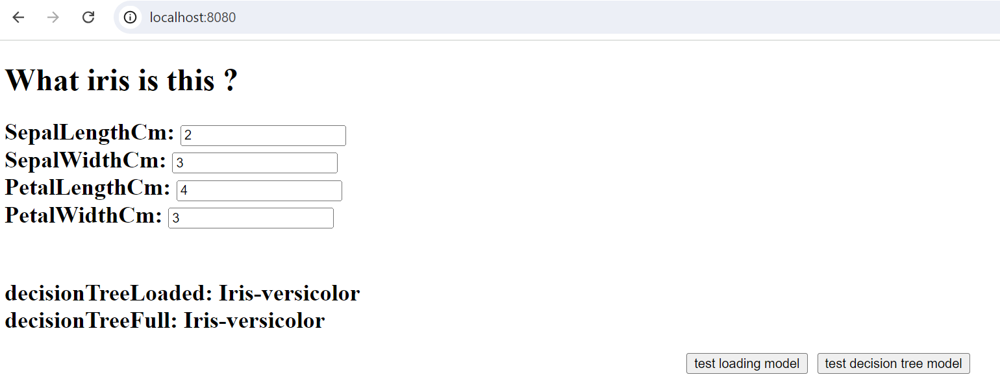

# wasm (dart)

A simple demo for [ml_algo](https://pub.dev/packages/ml_algo)
Decision tree example for predicting an iris' species based on its dimensions.
This simple js web demo uses Dart Web Assembly support

## building/running
- Serve the output, example

$ dart pub global activate dhttpd
$ dart pub global run dhttpd

- Open your browser at : http://localhost:8080/site/index.html

- type flower dimensions and run either using :
    - a preloaded model (faster) 
    - training a (small) model on the fly

- Compile with Wasm to a new site output directory:
 
$ dart compile wasm web/main.dart -o site/test.wasm

For more details see documentation from https://dart.dev/web/wasm
